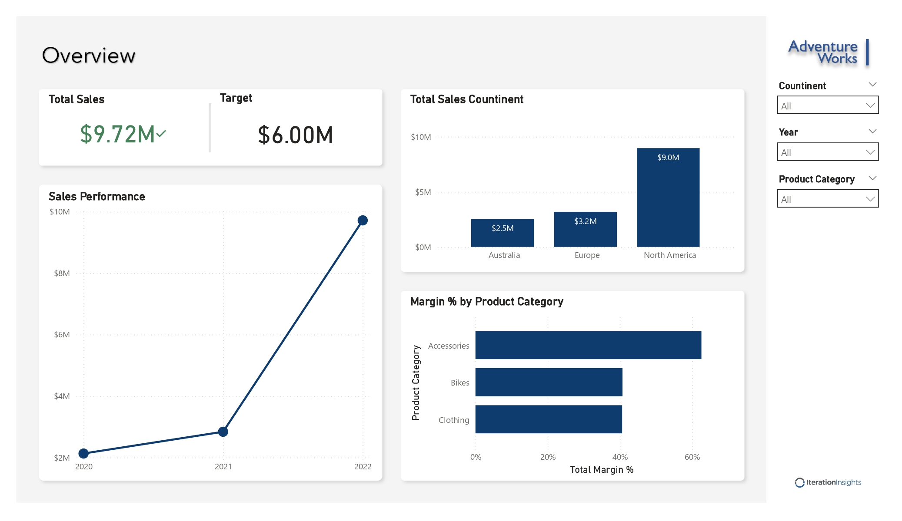
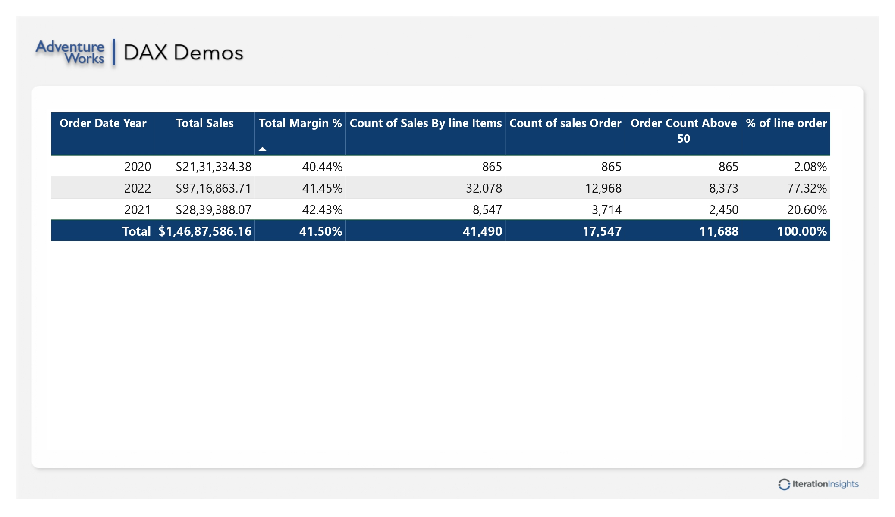
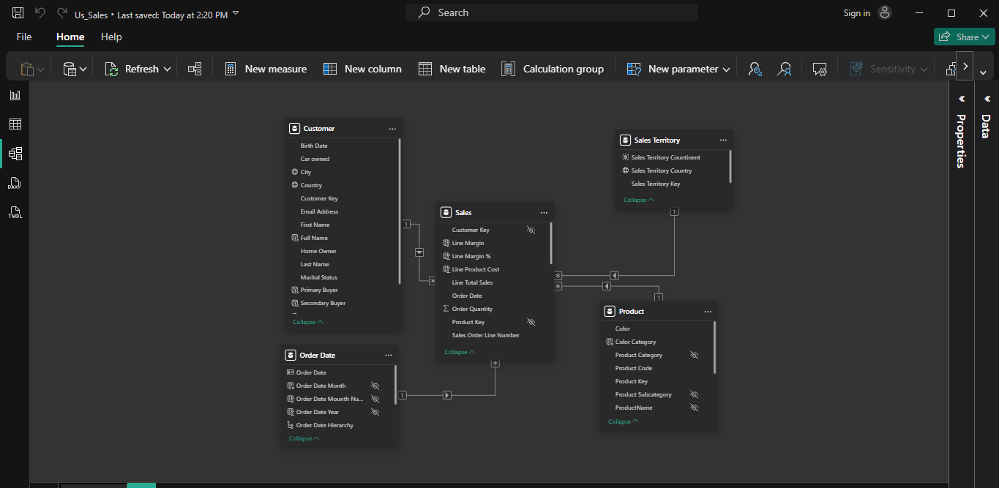

# 📊 Sales Dashboard — Power BI


A multi-page interactive sales analytics dashboard built with Power BI Desktop using the **AdventureWorks** dataset. Covers end-to-end analysis — from data modeling to DAX measures to visual storytelling.

---

## 📸 Dashboard Preview

### Overview Page



### DAX Demos Page



### Data Model View



---

## 🗂️ Data Model

The report uses a **star schema** with one fact table and four dimension tables:

| Table             | Type      | Key Fields                                                              |
| ----------------- | --------- | ----------------------------------------------------------------------- |
| `Sales`           | Fact      | Customer Key, Product Key, Order Date, Line Total Sales, Order Quantity |
| `Customer`        | Dimension | Customer Key, Full Name, City, Country, Marital Status                  |
| `Product`         | Dimension | Product Key, ProductName, Product Category, Product Subcategory, Color  |
| `Order Date`      | Dimension | Order Date, Month, Year, Hierarchy                                      |
| `Sales Territory` | Dimension | Sales Territory Key, Country, Continent                                 |

> Relationships follow a standard one-to-many pattern from dimension tables to the `Sales` fact table.

---

## 📄 Report Pages

### 1. Overview

High-level performance summary with slicers for Continent, Year, and Product Category.

**Visuals:**

- KPI Cards — Total Sales ($9.72M) vs Target ($6.00M)
- Line Chart — Sales Performance trend (2020–2022)
- Bar Chart — Total Sales by Continent (Australia, Europe, North America)
- Horizontal Bar Chart — Margin % by Product Category (Accessories, Bikes, Clothing)

**Key Insight:** North America dominates at $9.0M. Accessories carry the highest margin % (~60%).

---

### 2. DAX Demos

Tabular breakdown demonstrating advanced DAX measures across years.

**Measures showcased:**

| Measure                        | Description                                        |
| ------------------------------ | -------------------------------------------------- |
| `Total Sales`                  | `SUM(Sales[Line Total Sales])`                     |
| `Total Margin %`               | `DIVIDE(SUM(Line Margin), SUM(Line Total Sales))`  |
| `Count of Sales By Line Items` | `COUNTROWS(Sales)`                                 |
| `Count of Sales Orders`        | `DISTINCTCOUNT(Sales[Sales Order Line Number])`    |
| `Order Count Above 50`         | `CALCULATE([Count], filter condition on quantity)` |
| `% of Line Order`              | Running % share per year                           |

**Sample Output (2020–2022):**

| Year      | Total Sales      | Margin %   | Line Items | Orders     |
| --------- | ---------------- | ---------- | ---------- | ---------- |
| 2020      | $21,31,334       | 40.44%     | 865        | 865        |
| 2021      | $28,39,388       | 42.43%     | 8,547      | 3,714      |
| 2022      | $97,16,863       | 41.45%     | 32,078     | 12,968     |
| **Total** | **$1,46,87,586** | **41.50%** | **41,490** | **17,547** |

---

## 🧮 Key DAX Measures

```dax
-- Total Sales
Total Sales = SUM(Sales[Line Total Sales])

-- Total Margin %
Total Margin % = DIVIDE(SUM(Sales[Line Margin]), SUM(Sales[Line Total Sales]))

-- Count of Distinct Orders
Count of Sales Orders = DISTINCTCOUNT(Sales[Sales Order Line Number])

-- Orders above quantity threshold
Order Count Above 50 =
    CALCULATE(
        COUNTROWS(Sales),
        Sales[Order Quantity] > 50
    )

-- % Share of Line Orders
% of line order =
    DIVIDE(
        [Count of Sales By line Items],
        CALCULATE([Count of Sales By line Items], ALL(Sales))
    )
```

---

## ⚡ Interactive Features

- **Custom Tooltips** — Designed and integrated customized tooltip pages to display detailed, context-specific metrics when users hover over data points.
- **Drill-Through Capabilities** — Enabled page-level drill-through filters, allowing users to right-click visual elements to jump to deep-dive reports filtered automatically by their selection.
- **Data Hierarchies** — Configured navigation hierarchies (e.g., Date and Product categories) to allow users to drill down from high-level summaries into granular details.

---

## 🛠️ Tools & Skills Used

- **Power BI Desktop** — Report authoring
- **DAX** — Calculated measures and KPIs
- **Power Query (M)** — Data transformation and cleaning
- **Star Schema Modeling** — Fact + dimension table relationships
- **Data Visualization** — KPI cards, line charts, bar charts, matrix tables
- **Interactive Features** — Tooltips, drill-through pathways, and hierarchies for detailed analysis

---

## 📁 File Structure

```
📦 adventureworks-sales-dashboard
 ┣ 📊 Sales.pbix                  # Power BI report file
 ┣ 📁 images/
 ┃ ┣ 🖼️ Sales_page-0001.jpg      # Overview page screenshot
 ┃ ┣ 🖼️ Sales_page-0002.jpg      # DAX Demos page screenshot
 ┃ ┗ 🖼️ modle_view.png           # Data model screenshot
 ┗ 📄 README.md
```

---

## 🚀 How to Open

1. Download and install [Power BI Desktop](https://powerbi.microsoft.com/desktop/) (free)
2. Clone or download this repository
3. Open `Sales.pbix` in Power BI Desktop
4. Explore the report pages and interact with slicers

---

## 💡 What I Learned

- Designing a clean **star schema** data model in Power BI
- Writing intermediate to advanced **DAX measures** (CALCULATE, DIVIDE, DISTINCTCOUNT, ALL)
- Building a multi-page report with **consistent theming and layout**
- Implementing advanced user features like **tooltips, drill-throughs, and hierarchies** for enhanced dashboard navigation
- Using **filter context** to create dynamic KPIs that respond to slicers
- Communicating business insights visually — not just displaying numbers

---

## 👤 Author

**Yash Awasthi**  
BCA (AI & Data Science) | SAGE University, Bhopal  
📧 yashonwork247@gmail.com  
🔗 [LinkedIn](https://linkedin.com/in/yashawasthi27) | [GitHub](https://github.com/yashawasthi27) | [Portfolio](https://yashawasthi27.github.io/Portfolio/)

---

> _Part of my ongoing Data Analytics learning journey. Built as a hands-on project to practice Power BI data modeling and DAX._
